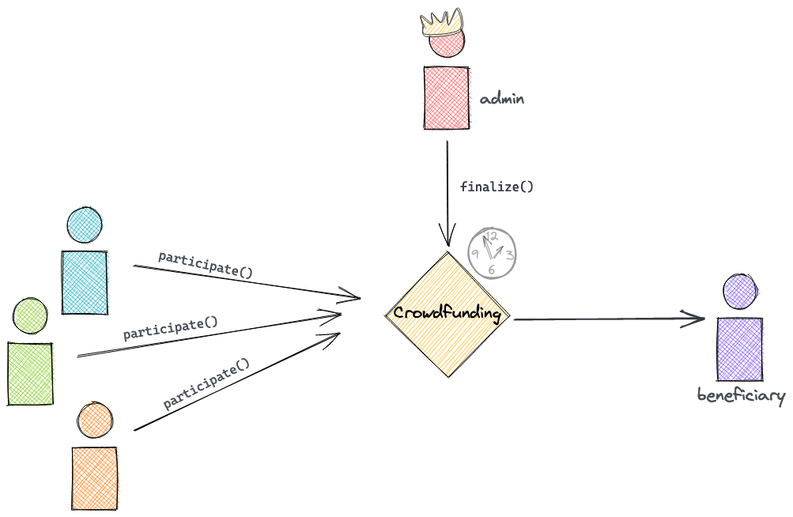

# Pythonic DAO

Decentralized Autonomous Organization (DAO)

an organization that was designed to be automated and decentralized, acting as a form of venture capital fund, based on open-source code and without a typical management structure or board of directors
(Source: Investopedia)

This repository only serve as a basic Crowdfunding Contract written in Vyper
to serve as an Origin Example where users can come together decentrally and autonomously
organizing for a cause such as crowdfunding.



Eventually I believe that through iterations, this serves as a ground floor in DAO development
such as those seen by popular DAO projects on Ethereum and many to come on SmartBCH


## Environment Set-up

0. (Optional) Use Poetry as our Python Pacakge Manager

    ```bash
    $ pip install -U poetry
    > ...
    $ poetry init
    > ...
    ```

1. Add our Smart Contract Framework, my weapon of choice is [Brownie](https://github.com/eth-brownie/brownie)

    ```bash
    $ poetry add eth-brownie
    > ...
    ```

2. This is a useful library I always use for wallet generation, see `generate-mnemonic.py` script.

    ```bash
    $ poetry add bip-utils
    > ...
    ```

4. Run `eth-brownie` initate command on your Terminal

    ```bash
    brownie init --force
    > ...
    ```

## Deploy for Local Testing and Interaction

```bash
$ brownie run deploy-crowdfund --interactive
```

## Add a new Network for Deployments

```bash
$ brownie networks add [environment] [id] host=[host] [KEY=VALUE, ...]
```

(See: [Brownie ReadTheDocs](https://eth-brownie.readthedocs.io/en/stable/network-management.html#adding-a-new-network))

## Example DAPP

To run the attached Example DAPP that interacts with the contract, first you must install the extra dependencies as such.

```bash
poetry install -E dapp
```

Then you will be able to serve the app located in the root directory under `serve.py` file as followed

```bash
uvicorn serve:dapp
```


## License

This project is licensed under the terms of the MIT license.
